# Retail Sales Batch Pipeline - Architecture

## 📐 System Architecture

### High-Level Overview
```
CSV Data → Google Cloud Storage (GCS) → Apache Beam/Dataflow → BigQuery → Analytics & Reporting
```

## Components

### 1. **Data Source**
- **Format**: CSV files with sales transaction data
- **Location**: `data/sample_data.csv`
- **Fields**:
  - `order_id`: Unique order identifier
  - `product_id`: Product identifier
  - `category`: Product category
  - `price`: Unit price
  - `quantity`: Order quantity
  - `order_date`: Transaction date

### 2. **Cloud Storage (GCS)**
- **Purpose**: Staging area for raw and processed data
- **Buckets**:
  - `gs://<bucket-name>/raw/`: Raw CSV uploads
  - `gs://<bucket-name>/temp/`: Temporary Dataflow artifacts
  - `gs://<bucket-name>/staging/`: Staged Dataflow binaries

### 3. **Apache Beam Pipeline**
- **File**: `pipeline/retail_sales.py`
- **Responsibilities**:
  - Reads CSV data from GCS
  - Transforms data (calculates revenue, validates fields)
  - Writes processed data to BigQuery
- **Key Steps**:
  1. **Read**: Extract CSV records from GCS
  2. **Transform**: Apply business logic (revenue calculation, data validation)
  3. **Write**: Load processed data into BigQuery

### 4. **Google Dataflow**
- **Managed Service**: Runs Apache Beam pipelines on GCP infrastructure
- **Configuration**:
  - Runner: `DataflowRunner`
  - Region: `asia-south1`
  - Auto-scaling enabled

### 5. **BigQuery**
- **Purpose**: Data warehousing and analytics
- **Dataset**: `retail_analytics`
- **Tables**:
  - `sales_cleaned`: Processed transaction data (created by pipeline)
  - `sales_summary`: Aggregated sales metrics (created by SQL)

## Data Flow Pipeline

```mermaid
graph LR
    A["Raw CSV<br/>data/sample_data.csv"] -->|Upload| B["Google Cloud Storage<br/>gs://bucket/raw/"]
    B -->|Read| C["Apache Beam<br/>Pipeline"]
    C -->|Transform<br/>Business Logic| D["Data Validation<br/>Revenue Calculation"]
    D -->|Write| E["BigQuery<br/>retail_analytics.sales_cleaned"]
    E -->|SQL Query| F["Sales Summary Table<br/>retail_analytics.sales_summary"]
    F -->|Analytics| G["Reports & Dashboards"]
```



## Transformation Logic

### Input Validation
- Skips header row (`order_id == 'order_id'`)
- Validates numeric fields (price, quantity)

### Business Logic
- **Revenue Calculation**: `revenue = price × quantity`
- **Load Date**: Current UTC timestamp in YYYY-MM-DD format

### Output Schema
```json
{
  "order_id": "string",
  "product_id": "string",
  "category": "string",
  "price": "float",
  "quantity": "integer",
  "order_date": "string",
  "revenue": "float",
  "load_date": "string"
}
```

## Aggregation Layer

The `sales_summary.sql` creates an aggregated view:
```sql
SELECT
  order_date,
  category,
  SUM(revenue) AS total_revenue,
  SUM(quantity) AS total_quantity
GROUP BY order_date, category
```

## Deployment Architecture

```
Development Machine
        ↓
   GCP Project
        ↓
   ├─ Cloud Storage
   ├─ Dataflow
   ├─ BigQuery
   └─ IAM & Credentials
```

## Technology Stack

| Component | Technology | Version |
|-----------|-----------|---------|
| Data Processing | Apache Beam | 2.54.0 |
| Orchestration | Google Dataflow | Latest |
| Data Warehouse | BigQuery | Latest |
| Storage | Google Cloud Storage | Latest |
| Analytics | SQL | N/A |

## Scalability & Performance

- **Auto-scaling**: Dataflow automatically scales workers based on data volume
- **Parallel Processing**: Multiple workers process data concurrently
- **Streaming Ready**: Architecture can be extended for real-time processing
- **Cost Optimization**: Pay-as-you-go pricing for Dataflow resources

## Error Handling & Monitoring

- **Dataflow Metrics**: CPU, memory, throughput monitoring
- **Pipeline Logging**: Detailed logs in Google Cloud Logging
- **Dead Letter Queue**: Failed records can be routed to error tables
- **Alerting**: CloudMonitoring can trigger alerts on failures

## Security Considerations

- Service account with least-privilege IAM roles
- GCS bucket encryption (default: Google-managed keys)
- BigQuery dataset-level access controls
- No hardcoded credentials (uses Application Default Credentials)

